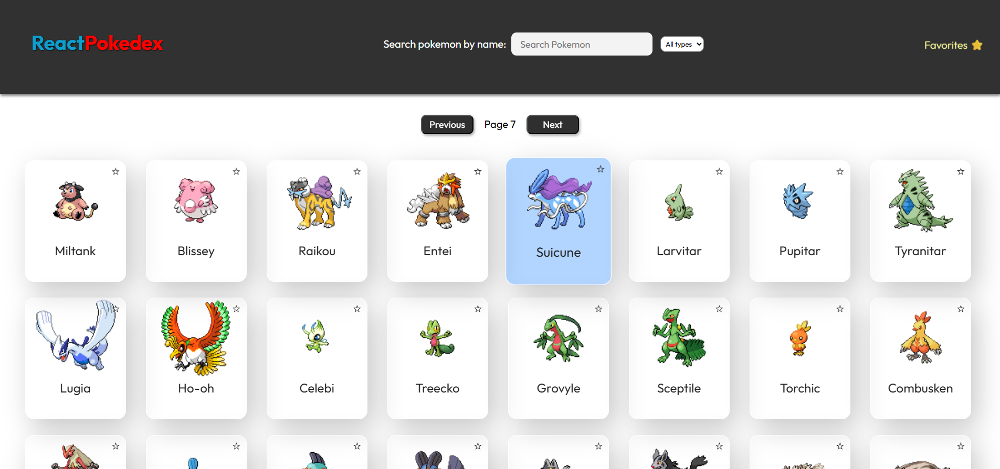
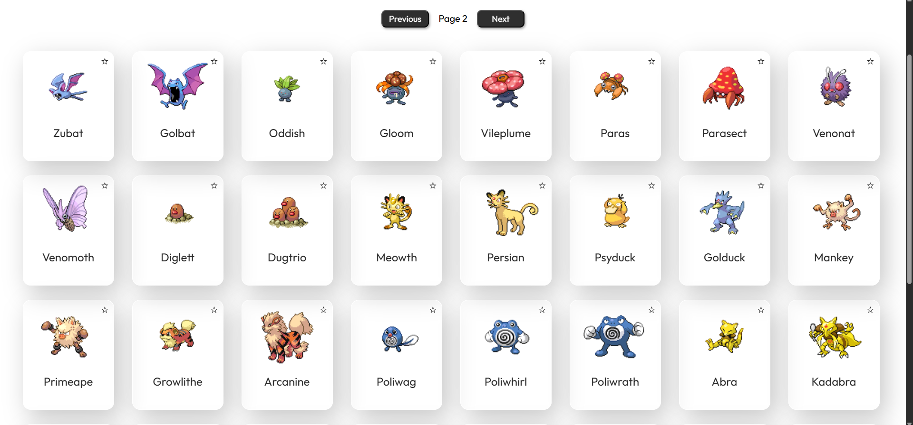
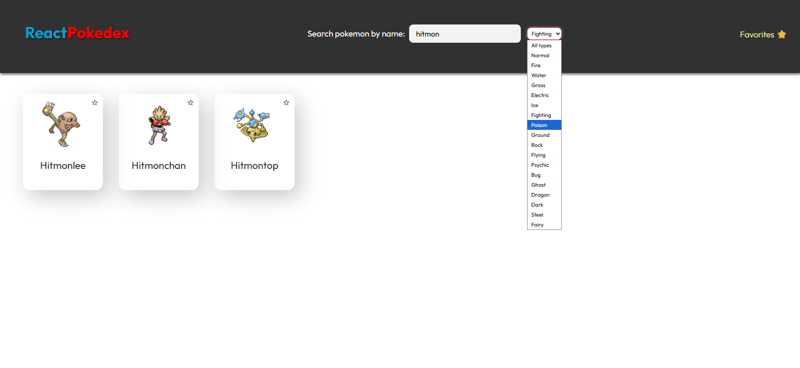
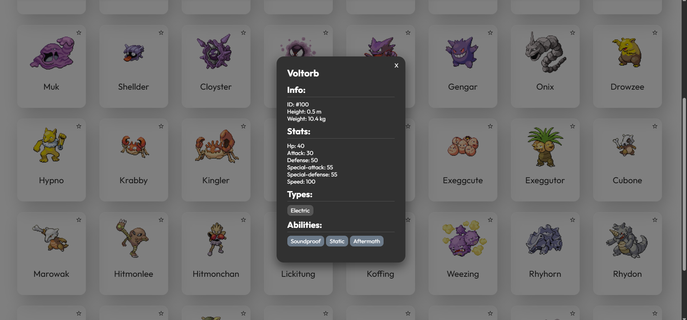
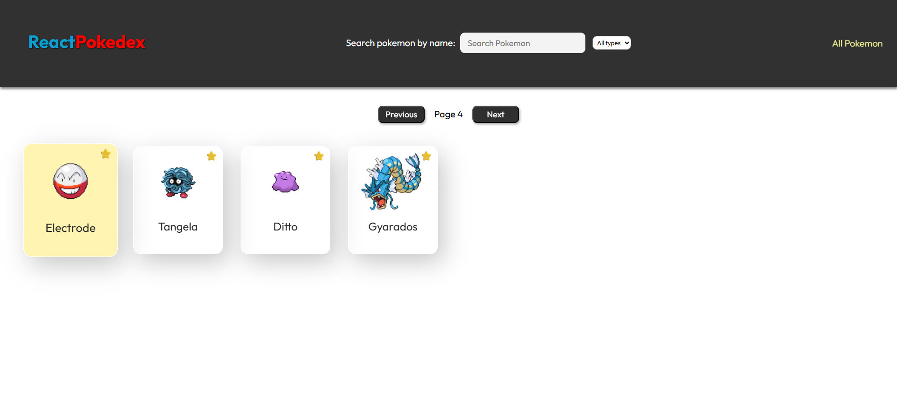
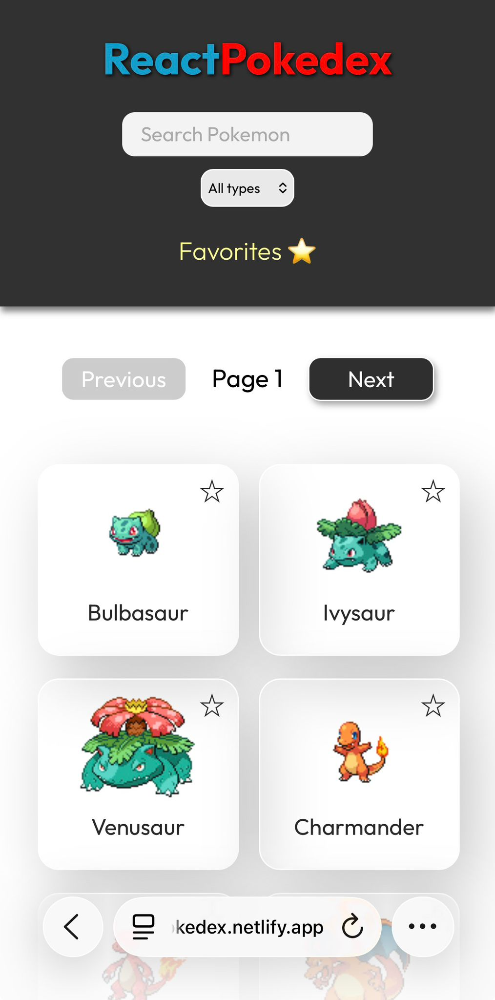

 # ⚡ React Pokédex

> An interactive Pokédex built with React, powered by the [PokéAPI](https://pokeapi.co/).



🔗 **Live demo:** [jmgfreactpokedex.netlify.app](https://jmgfreactpokedex.netlify.app/)

---

## 📋 Table of Contents

- [Features](#-features)
- [Technologies](#-technologies)
- [Installation](#-installation)
- [Usage](#-usage)
- [Screenshots](#-screenshots)
- [Author](#-author)

---

## ✨ Features

- 🔍 **Search** Pokémon by name in real time with debounce
- 🎯 **Filter by type** (fire, water, grass, electric...)
- ⭐ **Favorites system** with localStorage persistence
- 📄 **Pagination** to browse all Pokémon
- 🪟 **Detail modal** with stats, types, abilities, height and weight
- 📱 **Responsive design** for mobile, tablet and desktop
- 🎨 **Dynamic card colors** based on the Pokémon's type

---

## 🛠 Technologies

| Technology | Purpose |
|---|---|
| [React](https://react.dev/) | Main UI library |
| [React Router DOM](https://reactrouter.com/) | Page navigation |
| [PokéAPI](https://pokeapi.co/) | Pokémon data source |
| Plain CSS | Styles and animations |
| [Netlify](https://www.netlify.com/) | Deployment |

---

## 🚀 Installation

Follow these steps to run the project locally:

```bash
# 1. Clone the repository
git clone https://github.com/juanmagarcia88/react-pokedex

# 2. Enter the folder
cd react-pokedex

# 3. Install dependencies
npm install

# 4. Start the development server
npm run dev
```

Open [http://localhost:5173](http://localhost:5173) in your browser.

---

## 📖 Usage

1. Open the app and click **Enter** on the landing page
2. Browse Pokémon using the **pagination** controls
3. Use the **search bar** to find a Pokémon by name
4. Filter by **type** using the dropdown selector
5. Click the **star** on a card to add it to favorites
6. Click **Favorites ⭐** in the header to see only your favorites
7. Click any card to see its **full detail**

---

## 📸 Screenshots

### Landing page


### Pokémon list


### Type filter 


### Detail modal


### Favorites


### Mobile view


---

## 👤 Author

**juanmagarcia88**

- GitHub: [@juanmagarcia88](https://github.com/juanmagarcia88)
- Demo: [jmgfreactpokedex.netlify.app](https://jmgfreactpokedex.netlify.app/)

---

⭐ If you like this project, give it a star on GitHub!